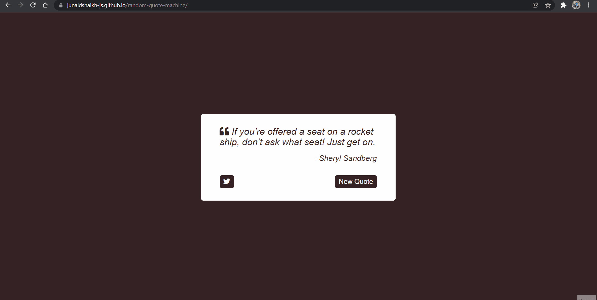

# FreeCodeCamp - Random Quote Generation Machine

This is a solution to the [Build a Random Quote Machine](https://www.freecodecamp.org/learn/front-end-development-libraries/front-end-development-libraries-projects/build-a-random-quote-machine).

## Table of contents

- [Overview](#overview)
  - [The challenge](#the-challenge)
  - [Screenshot](#screenshot)
  - [Links](#links)
- [My process](#my-process)
  - [Built with](#built-with)
  - [What I learned](#what-i-learned)
- [Author](#author)

## Overview

### The challenge

The challenge is to fulfill the user-stories given in the challenge and build the random quote generation machine.

### Screenshot

### Links

- Solution: [Solution](https://github.com/junaidshaikh-js/random-quote-machine)
- View Live: [Live Site](https://junaidshaikh-js.github.io/random-quote-machine/)

## My process

### Built with

- Semantic HTML5 markup
- SCSS | CSS Extension Language
- jQuery

### What I learned

This is my first project in which I used jQuery. I learn many different jQuery function which makes it easy to manipulate the DOM.

## Author

- Twitter - [@junaidshaikh_js](https://twitter.com/junaidshaikh_js)
- Linkedin - [Junaid Shaikh](https://www.linkedin.com/in/junaidshaikhjs/)
